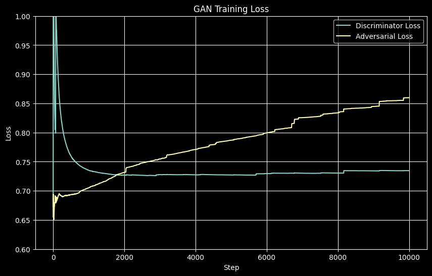
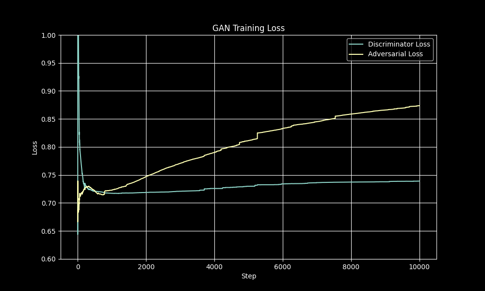
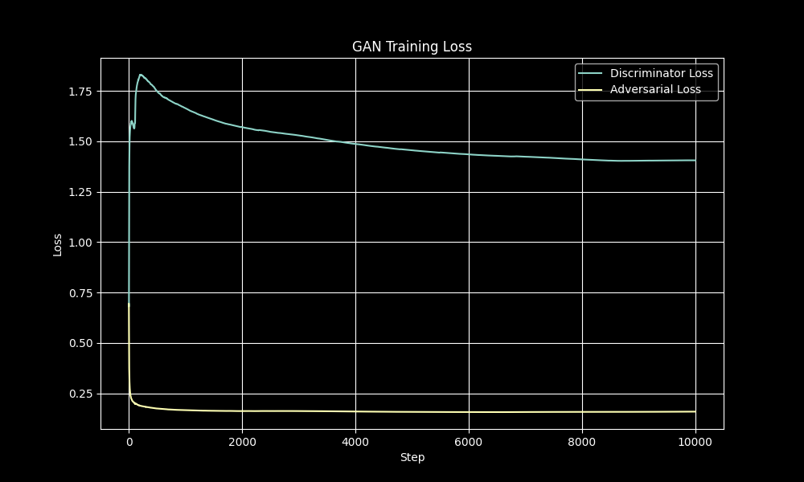
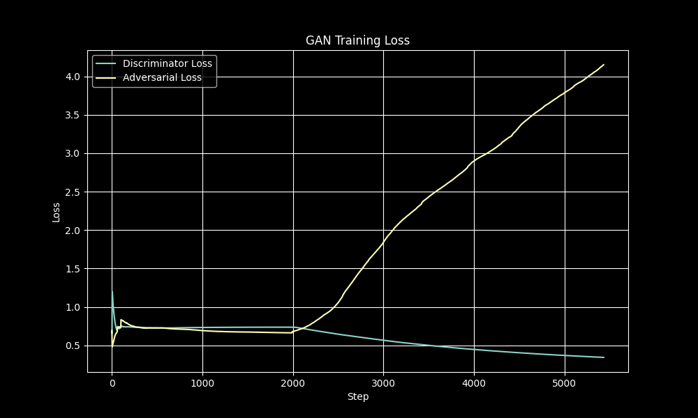
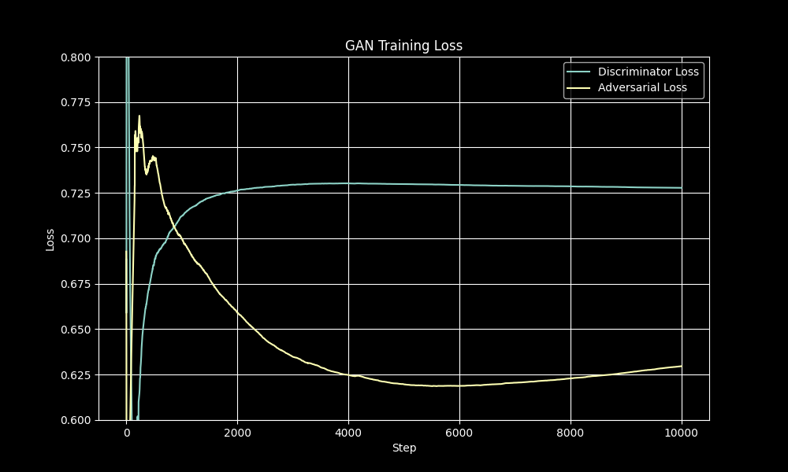
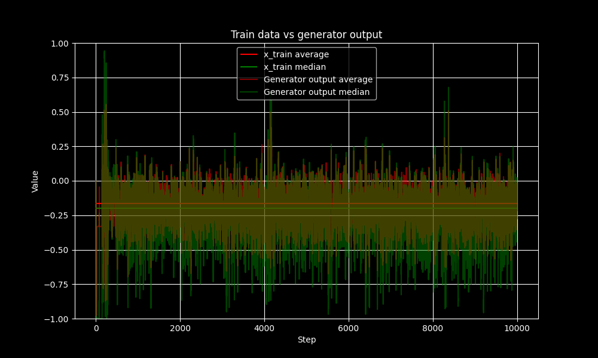

### run 1


### run 2


### run 3


### run 4


### run 5



## Changes made to the originial code proposed by Francois Chollet in the 1st edition od Deep learning book
```py
discriminator_optimizer = keras.optimizers.RMSprop(lr=0.0008, clipvalue=1.0, decay=1e-8)
```
becomes
```py
discriminator_optimizer = keras.optimizers.RMSprop(learning_rate=0.0008, clipvalue=1.0)
```

---

```py
gan_optimizer = keras.optimizers.RMSprop(lr=0.0004, clipvalue=1.0, decay=1e-8)
gan.compile(optimizer=gan_optimizer, loss='binary_crossentropy')
```
becomes
```py
gan_optimizer = keras.optimizers.RMSprop(learning_rate=0.0004, clipvalue=1.0)
gan.compile(optimizer=gan_optimizer, loss='binary_crossentropy')
discriminator.trainable = True

from google.colab import drive
import os

drive.mount('/content/drive')
save_dir = '/content/drive/MyDrive/to_delete'
history = { 'steps_to_plot': [], 'd_losses': [], 'a_losses': [], 'average': [], 'median': []}
images_dir = os.path.join(save_dir, 'gan_images')
import shutil
shutil.rmtree(images_dir, ignore_errors=True)
os.makedirs(images_dir, exist_ok=True)
# step = 100
# gan.load_weights(os.path.join(save_dir, f'gan_step_{step}.weights.h5'))
# history_loaded = np.load(os.path.join(save_dir, f'history_step_{step}.npz'))
# history = {key: history_loaded[key].tolist() for key in history_loaded.files}
```

---

```py
x_train = x_train.reshape(
    (x_train.shape[0],) + (height, width, channels)).astype('float32') / 255.

iterations = 10000
batch_size = 20
save_dir = '/home/ubuntu/gan_images/'
```
becomes
```py
x_train = x_train.reshape(
    (x_train.shape[0],) + (height, width, channels)).astype('float32') / 127.5 - 1
iterations = 10000
batch_size = 20
```

---

```py
generated_images = generator.predict(random_latent_vectors)
```
becomes
```py
generated_images = generator.predict(random_latent_vectors, verbose=0)
history['steps_to_plot'].append(step)
history['average'].append(np.average(generated_images))
history['median'].append(np.median(generated_images))
```

---

```py
a_loss = gan.train_on_batch(random_latent_vectors, misleading_targets)
```
becomes
```py
a_loss = gan.train_on_batch(random_latent_vectors, misleading_targets)
history['d_losses'].append(d_loss)
history['a_losses'].append(a_loss)
```

---

```py
if step % 100 == 0:
    # Save model weights
    gan.save_weights('gan.h5')

    # Print metrics
    print('discriminator loss at step %s: %s' % (step, d_loss))
    print('adversarial loss at step %s: %s' % (step, a_loss))
```
becomes
```py
save_interval = 200
if step % save_interval == 0:
    gan.save_weights(os.path.join(save_dir, f'gan_step_{step}.weights.h5'))
    np.savez_compressed(os.path.join(save_dir, f'history_step_{step}.npz'), **history)
    previous_file = os.path.join(save_dir, f'gan_step_{step - save_interval}.weights.h5')
    if os.path.exists(previous_file):
        with open(previous_file, 'w') as f: pass
        os.remove(previous_file)
    previous_file = os.path.join(save_dir, f'history_step_{step - save_interval}.npz')
    if os.path.exists(previous_file):
        with open(previous_file, 'w') as f: pass
        os.remove(previous_file)
    print(f'step {step}, discriminator loss: {d_loss:.4f}, adversarial loss: {a_loss:.4f}')
```

```py
img = image.array_to_img(generated_images[0] * 255., scale=False)
img.save(os.path.join(images_dir, 'generated_frog' + str(step) + '.png'))

# Save one real image, for comparison
img = image.array_to_img(real_images[0] * 255., scale=False)
img.save(os.path.join(save_dir, 'real_frog' + str(step) + '.png'))
```
becomes
```py
img = image.array_to_img((generated_images[0] + 1) * 127.5, scale=False)
img.save(os.path.join(images_dir, 'generated_frog' + str(step) + '.png'))

# Save one real image, for comparison
img = image.array_to_img((real_images[0] + 1) * 127.5, scale=False)
img.save(os.path.join(images_dir, 'real_frog' + str(step) + '.png'))
```

---

```py
img = image.array_to_img(generated_images[i] * 255., scale=False)
```
becomes
```py
img = image.array_to_img((generated_images[i] + 1) * 127.5, scale=False)
```

---

added
```py
import matplotlib.pyplot as plt
plt.style.use('dark_background')

plt.figure(figsize=(10, 6))
plt.plot(history['steps_to_plot'], history['d_losses'], label='Discriminator Loss')
plt.plot(history['steps_to_plot'], history['a_losses'], label='Adversarial Loss')
plt.title('GAN Training Loss')
plt.xlabel('Step')
plt.ylabel('Loss')
plt.legend()
plt.ylim(0.6, 1)
plt.grid(True)
plt.savefig(os.path.join(save_dir, 'training_loss.png'))
plt.show()

plt.figure(figsize=(10, 6))
beg = min(history['steps_to_plot'])
end = max(history['steps_to_plot'])
plt.hlines(np.average(x_train), beg, end, label='x_train average', color='red')
plt.hlines(np.median(x_train), beg, end, label='x_train median', color='green')
plt.plot(history['steps_to_plot'], history['average'], label='Generator output average', alpha = 0.5, color='red')
plt.plot(history['steps_to_plot'], history['median'], label='Generator output median', alpha = 0.5, color='green')
plt.title('Train data vs generator output')
plt.xlabel('Step')
plt.ylabel('Value')
plt.legend()
plt.ylim(-1, 1)
plt.grid(True)
plt.savefig(os.path.join(save_dir, 'average_and_median.png'))
plt.show()
```
