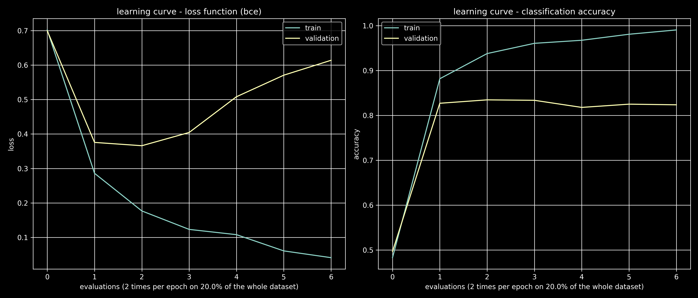

### Written in PyTorch binary text classification (imdb sentiment analysis) using decoder-only transformer

Heavily based on https://github.com/karpathy/ng-video-lecture/blob/master/gpt.py and https://www.youtube.com/watch?v=kCc8FmEb1nY (Let's build GPT: from scratch, in code, spelled out.)

The code is run with `python main.py`

Trained in under 10 minutes on T4 in Google Collab

